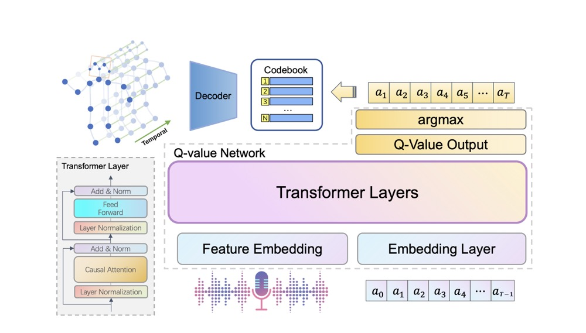
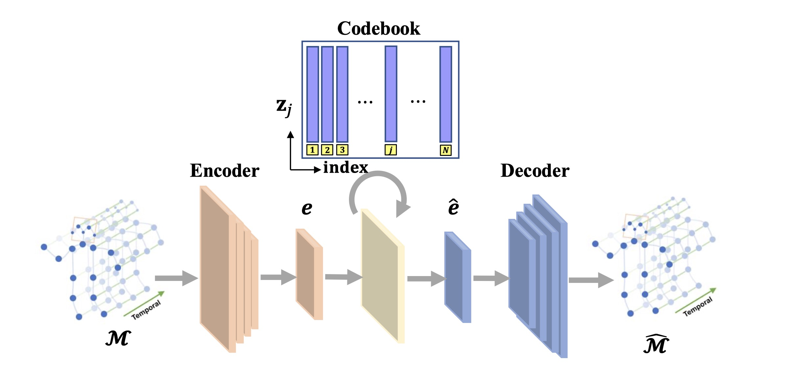
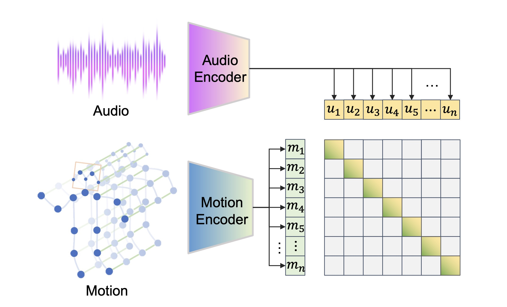

# RACER: Co-speech Gesture Synthesis by Reinforcement Learning with Contrastive Pre-trained Reward

The video demo for “Co-speech Gesture Synthesis by Reinforcement Learning with Contrastive Pre-trained Reward (CVPR2023 OpenReview)” is available at: <https://youtu.be/Nyvei34nMBU>

The character is from Mixamo (<https://www.mixamo.com>).

> There is a growing demand of automatically synthesizing co-speech gestures for virtual characters. However, it remains a challenge due to the complex relation between input speeches and target gestures. Existing works focus on learning a mapping from speeches to gestures in a supervised manner, ignoring the fact that co-speech gesture synthesis is a sequential decision making problem by nature. In this paper, we propose a novel reinforcement learning (RL) framework called **RACER** to generate sequences of gestures that maximize the overall satisfactory. **RACER** employs a vector quantized variational autoencoder to learn compact representations of gestures and a GPT-based policy architecture to generate coherent sequence of gestures autoregressively. In particular, we propose a contrastive pre-training approach to calculate the rewards, which integrates contextual information into action evaluation and successfully captures the complex relationships between multi-modal speech-gesture data. To our knowledge, **RACER** is the first co-speech gesture synthesizing frameworsk that is trained solely by RL. Experimental results show that our method significantly outperforms existing baselines in terms of both objective metrics and subjective human judgements.

## Introduction
RACER is a novel RL based approach to learn the optimal gesture synthesis policy, which models the co-speech gesture synthesis problem as a Markov decision process. The overview of our proposed framework RACER is shown in:

Given a piece of speech audio and the initial gesture code $a_0$, the GPT-like Q-network represented by transformer layers autoregressively calculates the Q-values and selects a sequence of actions ($a_1,\cdots,a_T$). The action sequence will then be transformed to quantitative features by querying the codebook and finally be decoded to motion sequences by the decoder of VQ-VAE.

Moreover, a contrastive speech-gesture pre-training method is proposed to compute the rewards, which guide the RL agent to discover deeper relations from multi-modal speech-gesture data.

Both VQ-VAE and the reward model are trained in seperate phases. In the final phase, RACER adopts a simple but effective offline reinforcement learning algorithm called conservative Q-learning(CQL) to learn the optimal policy from the augmented offline dataset.

## Architectures of Networks
“Conv” and “TransConv” represent 1D temporal the convolution and transpose-convolution operations, respectively, and their arguments represent the input channel number, the output channel number, the kernel size, the convolution stride, the padding size on both ends of input data, and the dilation number in turn.

|    | **Residual Block**  |
|  ---  | :----:  |
|  | Input: **0**; Argument: p, d|
|**1** | ReLU, Conv(512, 512, 3, 1, p, d)|
|**2** |ReLU, Conv(512, 512, 1, 1, 0, 1)|
|   |Output: **0** + **2**|

|    | **VQ-VAE Encoder**  |
|  ---  | :----:  |
|  | **Input: 0; Argument:** *J*|
|**1** |Conv(*J* × 3, 512, 4, 2, 1, 1)|
|**2**|**RB**(p = 1, d = 1)|
|**3** |**RB**(p = 3, d = 3)|
|**4** |**RB**(p = 9, d = 9)|
|**5** |Conv(512, 512, 4, 2, 1, 1)|
|**6**|**RB**(p = 1, d = 1)|
|**7** |**RB**(p = 3, d = 3)|
|**8** |**RB**(p = 9, d = 9)|
|**9** |Conv(512, 512, 4, 2, 1, 1)|
|**10**|**RB**(p = 1, d = 1)|
|**11** |**RB**(p = 3, d = 3)|
|**12** |**RB**(p = 9, d = 9)|
|**13** |Conv(512, 512, 3, 1, 1, 1)|
|   |Output: **13**|

|    | **VQ-VAE Decoder**  |
|  ---  | :----:  |
|  | **Input: 0; Argument:** *J*|
|**1** |Conv(512, 512, 3, 1, 1, 1)|
|**2**|**RB**(p = 9, d = 9)|
|**3** |**RB**(p = 3, d = 3)|
|**4** |**RB**(p = 1, d = 1)|
|**5** |Conv(512, 512, 4, 2, 1, 1)|
|**6**|**RB**(p = 9, d = 9)|
|**7** |**RB**(p = 3, d = 3)|
|**8** |**RB**(p = 1, d = 1)|
|**9** |Conv(512, 512, 4, 2, 1, 1)|
|**10**|**RB**(p = 9, d = 9)|
|**11** |**RB**(p = 3, d = 3)|
|**12** |**RB**(p = 1, d = 1)|
|**13** |Conv(512, *J* × 3, 4, 2, 1, 1)|
|   |Output: **13** |

